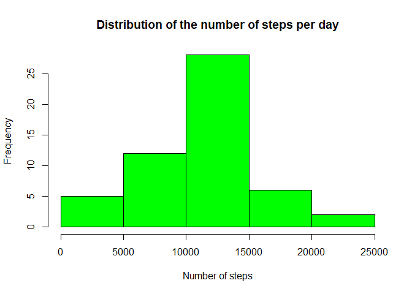
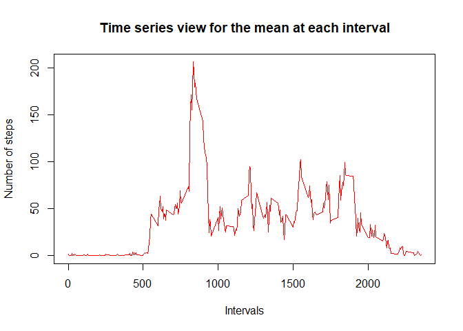
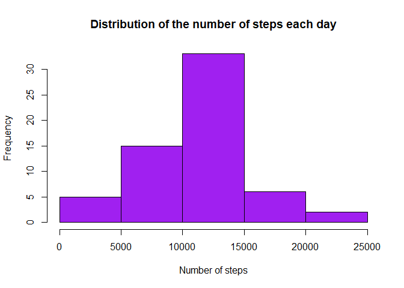
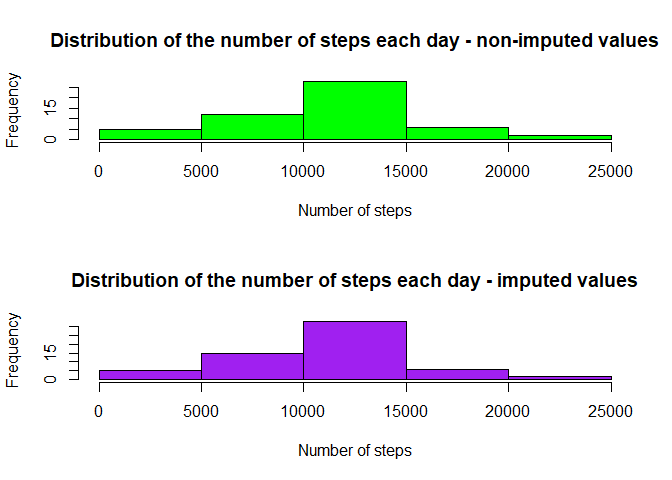
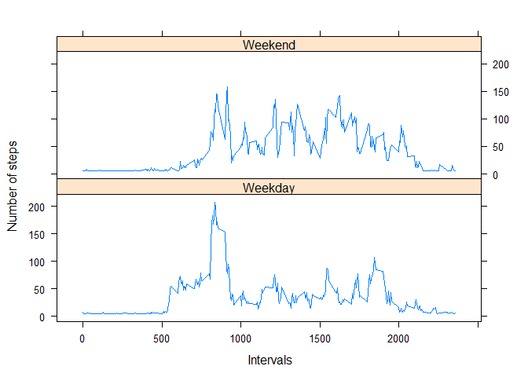

# Reproducible Research: Peer Assessment 1


## Loading and preprocessing the data
### I load the dataset in memory:

```r
unzip(zipfile = "activity.zip")
data <- read.csv("activity.csv", header = TRUE, sep = ",")
head(data)
```

```
##   steps       date interval
## 1    NA 2012-10-01        0
## 2    NA 2012-10-01        5
## 3    NA 2012-10-01       10
## 4    NA 2012-10-01       15
## 5    NA 2012-10-01       20
## 6    NA 2012-10-01       25
```
### I Transform/adapt the dataset with appropriate variables to be able to answer the question:
1. I create a new column/variable called **newdate**, which will be the conversion of the variable **date** from factor  
2. To date class. I keep the orginial factor variable, as I will use it to compute the daily sum of steps later  
3. I convert the variable **steps** from int class to numeric class  
4. I convert the variable **interval** from int class to numeric class  
5. I create a new variable called **weekday** to identify weekdays in the dataframe  

```r
data$newdate <- as.Date(data$date, format = "%Y-%m-%d")                  
data$steps <- as.numeric(data$steps)                                    
data$interval <- as.numeric(data$interval)                              
data$weekday <- weekdays(data$newdate, abbreviate = TRUE)
```
### Categorize the days as belonging to weekday category or weekend category
1. I create a temporary data frame **templabel** which will serve as a corresponding matrix for the catgorization of the days **weekday** and **weekend**:
2. I assign column names to the columns  
3. I create a new column/variable called **daycat** in which I will insert the corresponding category, matching the one in the **templabel** dataframe  

```r
templabel <- data.frame(c("lun.", "mar.", "mer.", "jeu.", "ven.", "sam.", "dim."), c("weekday", "weekday", "weekday", "weekday", "weekday", "weekend", "weekend"))
colnames(templabel) <- c("weekday", "category")                         
data$daycat = templabel$category[match(data$weekday, templabel$weekday)]
```

```
##   steps       date interval    newdate weekday  daycat
## 1    NA 2012-10-01        0 2012-10-01    lun. weekday
## 2    NA 2012-10-01        5 2012-10-01    lun. weekday
## 3    NA 2012-10-01       10 2012-10-01    lun. weekday
## 4    NA 2012-10-01       15 2012-10-01    lun. weekday
## 5    NA 2012-10-01       20 2012-10-01    lun. weekday
## 6    NA 2012-10-01       25 2012-10-01    lun. weekday
```

## What is mean total number of steps taken per day?
1. Calculate the total number of steps taken per day:  
I generate a new dataframe aggregating the variables **steps** and **date**, and calculate the total number of steps per day

```r
dataStepsSum <- aggregate(steps ~ date, data, sum)
dataStepsSum
```

```
##          date steps
## 1  2012-10-02   126
## 2  2012-10-03 11352
## 3  2012-10-04 12116
## 4  2012-10-05 13294
## 5  2012-10-06 15420
## 6  2012-10-07 11015
## 7  2012-10-09 12811
## 8  2012-10-10  9900
## 9  2012-10-11 10304
## 10 2012-10-12 17382
## 11 2012-10-13 12426
## 12 2012-10-14 15098
## 13 2012-10-15 10139
## 14 2012-10-16 15084
## 15 2012-10-17 13452
## 16 2012-10-18 10056
## 17 2012-10-19 11829
## 18 2012-10-20 10395
## 19 2012-10-21  8821
## 20 2012-10-22 13460
## 21 2012-10-23  8918
## 22 2012-10-24  8355
## 23 2012-10-25  2492
## 24 2012-10-26  6778
## 25 2012-10-27 10119
## 26 2012-10-28 11458
## 27 2012-10-29  5018
## 28 2012-10-30  9819
## 29 2012-10-31 15414
## 30 2012-11-02 10600
## 31 2012-11-03 10571
## 32 2012-11-05 10439
## 33 2012-11-06  8334
## 34 2012-11-07 12883
## 35 2012-11-08  3219
## 36 2012-11-11 12608
## 37 2012-11-12 10765
## 38 2012-11-13  7336
## 39 2012-11-15    41
## 40 2012-11-16  5441
## 41 2012-11-17 14339
## 42 2012-11-18 15110
## 43 2012-11-19  8841
## 44 2012-11-20  4472
## 45 2012-11-21 12787
## 46 2012-11-22 20427
## 47 2012-11-23 21194
## 48 2012-11-24 14478
## 49 2012-11-25 11834
## 50 2012-11-26 11162
## 51 2012-11-27 13646
## 52 2012-11-28 10183
## 53 2012-11-29  7047
```

2. Make a histogram of the total number of steps taken each day:  

```r
hist(dataStepsSum$steps, col = "green", main = "Distribution of the number of steps per day", xlab = "Number of steps", ylab = "Frequency")
```

<!-- -->

3. Calculate and report the mean and median of the total number of steps taken per day:  

```r
rmean <- mean(dataStepsSum$steps)
rmedian <- median(dataStepsSum$steps)
```

The mean of the total number of steps taken per day is:

```
## [1] 10766.19
```

The Median of the total number of steps taken per day is: 

```
## [1] 10765
```

## What is the average daily activity pattern?
1. Make a time series plot (i.e. type = "l") of the 5-minute interval (x-axis) and the average number of steps taken, averaged across all days (y-axis)  

```r
dataInterval <- aggregate(steps ~ interval, data, mean)
plot(dataInterval$interval, dataInterval$steps, type = "l", col = "red", main = "Time series view for the mean at each interval", xlab = "Intervals", ylab = "Number of steps")
```

<!-- -->

2. Which 5-minute interval, on average across all the days in the dataset, contains the maximum number of steps?  

```r
max_interval <- dataInterval[which.max(dataInterval$steps),1]
```

The maximum number of steps occurs at the 5-minute interval is: 

```
## [1] 835
```

## Imputing missing values
1. Calculate and report the total number of missing values in the dataframe:  

```r
sumNA <- sum(is.na(data))
```

The total number of missing values is:

```
## [1] 2304
```

2. Devise a strategy for filling in all of the missing values in the dataset:  
I reorder the columns order of my dataset : placing the **date** column in first position and the **steps** column in second position.

```r
data2 <- data[, c(2, 1, 3, 4, 5, 6)]
```

I generate the dataframe, equal to the first one with missing values filled in. 
The strategy I chose, is to compute the mean of the number of steps for a given weekday (Monday, Tuesday....). So that for the days, where values are missing, I will fill it in with the corresponding mean value, for example : on Mondays, the mean of number of steps is 43, I will fill in the missing value with 43 for Mondays, and so on.

3. Create a new dataset that is equal to the original dataset but with the missing data filled in:  
  + I reorganize my column for more comprehension of my data frame:
  + I compute the mean for the number of steps per day
  + I extract the rows, where the values in the colum steps are equal to **NA(missing values)**
  + I replace the missing values with the corresponding values for the type of day on my dataframe **dataStep4**

```r
data2 <- data[, c(2, 1, 3, 4, 5, 6)]
dataSteps4 <- aggregate(steps ~ weekday, data, mean)
data2temp <- data2[rowSums(is.na(data2)) > 0,]
data2temp$steps = dataSteps4$steps[match(data2temp$weekday, dataSteps4$weekday)]
data3temp <- data2[complete.cases(data2), ]
finaldata <- rbind(data3temp, data2temp)
```


```
##           date steps interval    newdate weekday  daycat
## 289 2012-10-02     0        0 2012-10-02    mar. weekday
## 290 2012-10-02     0        5 2012-10-02    mar. weekday
## 291 2012-10-02     0       10 2012-10-02    mar. weekday
## 292 2012-10-02     0       15 2012-10-02    mar. weekday
## 293 2012-10-02     0       20 2012-10-02    mar. weekday
## 294 2012-10-02     0       25 2012-10-02    mar. weekday
```

4. Make a histogram of the total number of steps taken each day and Calculate and report the mean and median total number of steps taken per day. Do these values differ from the estimates from the first part of the assignment? What is the impact of imputing missing data on the estimates of the total daily number of steps?

  + Calculate and report the mean and median total number of steps taken per day.

```r
dataStepsSum2 <- aggregate(steps ~ date, finaldata, sum)
```


```
##          date     steps
## 1  2012-10-01  9974.857
## 2  2012-10-02   126.000
## 3  2012-10-03 11352.000
## 4  2012-10-04 12116.000
## 5  2012-10-05 13294.000
## 6  2012-10-06 15420.000
## 7  2012-10-07 11015.000
## 8  2012-10-08  9974.857
## 9  2012-10-09 12811.000
## 10 2012-10-10  9900.000
## 11 2012-10-11 10304.000
## 12 2012-10-12 17382.000
## 13 2012-10-13 12426.000
## 14 2012-10-14 15098.000
## 15 2012-10-15 10139.000
## 16 2012-10-16 15084.000
## 17 2012-10-17 13452.000
## 18 2012-10-18 10056.000
## 19 2012-10-19 11829.000
## 20 2012-10-20 10395.000
## 21 2012-10-21  8821.000
## 22 2012-10-22 13460.000
## 23 2012-10-23  8918.000
## 24 2012-10-24  8355.000
## 25 2012-10-25  2492.000
## 26 2012-10-26  6778.000
## 27 2012-10-27 10119.000
## 28 2012-10-28 11458.000
## 29 2012-10-29  5018.000
## 30 2012-10-30  9819.000
## 31 2012-10-31 15414.000
## 32 2012-11-01  8212.750
## 33 2012-11-02 10600.000
## 34 2012-11-03 10571.000
## 35 2012-11-04 12277.714
## 36 2012-11-05 10439.000
## 37 2012-11-06  8334.000
## 38 2012-11-07 12883.000
## 39 2012-11-08  3219.000
## 40 2012-11-09 12359.714
## 41 2012-11-10 12535.429
## 42 2012-11-11 12608.000
## 43 2012-11-12 10765.000
## 44 2012-11-13  7336.000
## 45 2012-11-14 11790.750
## 46 2012-11-15    41.000
## 47 2012-11-16  5441.000
## 48 2012-11-17 14339.000
## 49 2012-11-18 15110.000
## 50 2012-11-19  8841.000
## 51 2012-11-20  4472.000
## 52 2012-11-21 12787.000
## 53 2012-11-22 20427.000
## 54 2012-11-23 21194.000
## 55 2012-11-24 14478.000
## 56 2012-11-25 11834.000
## 57 2012-11-26 11162.000
## 58 2012-11-27 13646.000
## 59 2012-11-28 10183.000
## 60 2012-11-29  7047.000
## 61 2012-11-30 12359.714
```

  + Make a histogram of the total number of steps taken each day.  

```r
hist(dataStepsSum2$steps, col = "purple", main = "Distribution of the number of steps each day", xlab = "Number of steps", ylab = "Frequency")
```

<!-- -->

  + Do these values differ from the estimates from the first part of the assignment?  

```r
par(mfrow = c(2,1))
hist(dataStepsSum$steps, col = "green", main = "Distribution of the number of steps each day - non-imputed values", xlab = "Number of steps", ylab = "Frequency")
hist(dataStepsSum2$steps, col = "purple", main = "Distribution of the number of steps each day - imputed values", xlab = "Number of steps", ylab = "Frequency")
```

<!-- -->

**_=> We can see comparing theses graphs that the global pattern is similary._**


  + What is the impact of imputing missing data on the estimates of the total daily number of steps?  

a) _I calculate new **mean** and **median** of the total number of steps:_

```r
rmean2 <- mean(dataStepsSum2$steps)
rmedian2 <- median(dataStepsSum2$steps)
```

b) _The **new mean** of the total number of steps is:_ 

```
## [1] 10821.21
```

c) _The **new median** of the total number of stepsis:_

```
## [1] 11015
```

d) _I calculate difference between non **imputed values** and **imputed values**:_

```r
mean_gap <- rmean2 - rmean
median_gap <- rmedian2 - rmedian
sum_gap <- sum(dataStepsSum2$steps) - sum(dataStepsSum$steps)
```

e) _The difference mean between **imputed data** and **non-imputed data** is:_

```
## [1] 55.02092
```

f) _The difference median between **imputed data** and **non-imputed data** is:_

```
## [1] 250
```

g) _The difference sum between **imputed data** and **non-imputed data** is:_

```
## [1] 89485.79
```

## Are there differences in activity patterns between weekdays and weekends?
1. Create a new factor variable in the dataset with two levels - **Weekday** and **Weekend** indicating whether a given date is a weekday or weekend day:  

```r
library(lattice)
datatempX <- finaldata[, c(2, 3, 5, 6)]
zWeekday <- subset(datatempX, datatempX$daycat=="weekday")
zWeekend <- subset(datatempX, datatempX$daycat=="weekend")
zWeekdaymean <- aggregate(steps ~ interval, zWeekday, mean)
zWeekendmean <- aggregate(steps ~ interval, zWeekend, mean)
zWeekdaymean$daycat = "Weekday"
zWeekendmean$daycat = "Weekend"
zAlldays <- rbind(zWeekdaymean, zWeekendmean)
```

2. Make a panel plot containing a time series plot (i.e. type = "l") of the 5-minute interval (x-axis) and the average number of steps taken, averaged across all weekday days or weekend days (y-axis). See the README file in the GitHub repository to see an example of what this plot should look like using simulated data.  

```r
xyplot(steps ~ interval | daycat, layout = c(1,2), data = zAlldays, type = "l", xlab = " Intervals", ylab = "Number of steps" )
```

<!-- -->

We see that the activity starts earlier with regard to the figure of the week, and later on the figure of the weekend.
Last thing, there are more peaks in the days of the week, and the activity is more homogeneous in the weekend days.
